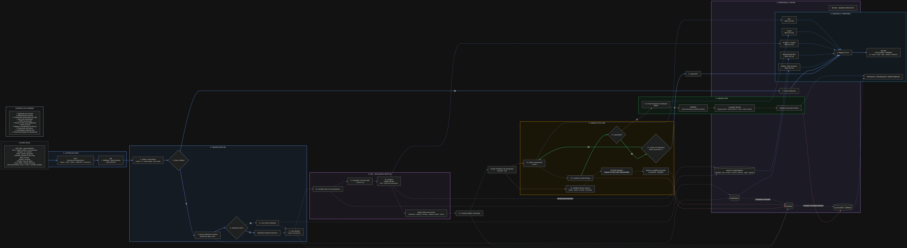

# Ecosistema IA de Gestión de Reseñas

### Entrega Final — AI Automation

Sistema automatizado para la gestión inteligente de reseñas de huéspedes de **Days Inn Parque Termal Dolores**, desarrollado con n8n, Notion, Google Gemini, Tally y Gmail.

El proyecto integra automatización, inteligencia artificial, RAG (Retrieval-Augmented Generation), Human-in-the-Loop (HITL), trazabilidad y manejo de errores en un único workflow end-to-end.

> **Nota:** los huéspedes, reseñas y ejecuciones incluidos en este repositorio corresponden a datos utilizados para pruebas y validación del prototipo.

---

## 1. Problema de negocio

La gestión manual de reseñas implica revisar comentarios, identificar al huésped, consultar información del hotel, redactar una respuesta, validarla, enviarla y registrar el resultado.

Este proceso puede generar:

- tiempos de respuesta elevados;
- respuestas inconsistentes;
- información incorrecta o inventada;
- poca trazabilidad;
- dificultad para supervisar grandes volúmenes de reseñas.

El objetivo del proyecto es automatizar gran parte del proceso sin eliminar el control humano sobre la comunicación final con el huésped.

---

## 2. Solución propuesta

El ecosistema automatiza el recorrido desde la recepción de una reseña hasta el envío de una respuesta aprobada.

Flujo conceptual:

**Tally → Webhook → Validación → Notion → RAG → Gemini → HITL → Gmail → Registro de ejecución**

La IA analiza y redacta, pero **no puede contactar directamente al huésped**. La respuesta debe ser aprobada por una persona antes del envío.

---

## 3. Arquitectura

El sistema se encuentra orquestado principalmente mediante **n8n**.

La arquitectura integra:

- **Tally** como canal de entrada.
- **n8n** como motor de automatización.
- **Notion** como memoria persistente y Base de Conocimiento.
- **Google Gemini** como modelo de IA.
- **Gmail** como canal de salida.
- **Human-in-the-Loop** como control previo a cualquier comunicación externa.

### Diagrama de arquitectura



---

## 4. Workflow end-to-end

El flujo principal realiza las siguientes etapas:

1. Recepción de la reseña mediante webhook.
2. Validación y normalización de los datos.
3. Identificación de un huésped existente o creación de uno nuevo.
4. Creación de la reseña en Notion.
5. Consulta de la Base de Conocimiento.
6. Consolidación del contexto RAG.
7. Análisis de sentimiento y urgencia mediante IA.
8. Generación del borrador de respuesta.
9. Guardado del análisis y borrador.
10. Notificación al revisor humano.
11. Espera y comprobación de aprobación.
12. Envío mediante Gmail únicamente cuando existe aprobación.
13. Actualización del registro de la reseña.
14. Registro de la ejecución exitosa.

El sistema también dispone de rutas específicas para gestionar errores en distintas etapas.

---

## 5. Tecnologías utilizadas

| Tecnología | Función |
|---|---|
| **n8n** | Orquestación y automatización del workflow |
| **Tally** | Captura de reseñas |
| **Notion** | Persistencia, RAG, seguimiento y dashboard |
| **Google Gemini** | Análisis y generación de respuestas |
| **Gmail** | Envío de respuestas aprobadas |
| **GitHub** | Repositorio y documentación de la entrega |

---

## 6. Modelo de datos en Notion

El ecosistema utiliza cuatro bases principales:

### Huéspedes

Mantiene la identificación de los huéspedes y permite reutilizar registros existentes mediante el email.

Archivo de evidencia: `Huéspedes.csv`

### Reseñas

Almacena la reseña original, calificación, borrador generado, aprobación, estado y resultado del procesamiento.

Archivo de evidencia: `Reseñas.csv`

### Base de Conocimiento

Contiene información autorizada del hotel utilizada para construir el contexto del sistema RAG.

Archivo de evidencia: `Base de Conocimiento.csv`

### Ejecuciones y Errores

Centraliza la trazabilidad técnica del workflow, permitiendo diferenciar ejecuciones exitosas y errores.

Archivo de evidencia: `Ejecuciones y Errores.csv`

---

## 7. Sistema RAG

Antes de redactar una respuesta, el workflow consulta la **Base de Conocimiento de Notion**.

Secuencia:

**Consultar Base de Conocimiento → Consolidar Contexto RAG → AI Agent**

El agente recibe:

- la información proporcionada en la reseña;
- el contexto recuperado desde la Base de Conocimiento.

Las instrucciones establecen que el modelo no debe inventar información que no se encuentre respaldada por esas fuentes.

El objetivo es reducir el riesgo de alucinaciones relacionadas con servicios, horarios, promociones, políticas u otra información del hotel.

---

## 8. Human-in-the-Loop (HITL)

La supervisión humana constituye uno de los controles principales de la arquitectura.

Después de generar el borrador:

**IA genera → Notion almacena → Humano revisa → n8n comprueba aprobación → Gmail envía**

Si la respuesta no está aprobada, Gmail no se ejecuta.

Además, el workflow incorpora un límite de comprobaciones para evitar una espera indefinida. Si se alcanza ese límite sin aprobación, la ejecución se deriva hacia una ruta de error y el huésped no es contactado.

---

## 9. Seguridad y resiliencia

El ecosistema incorpora distintas capas de control:

- validación de entrada;
- minimización de datos;
- RAG como mecanismo anti-alucinación;
- Human-in-the-Loop obligatorio;
- protección contra bucles de aprobación;
- `Retry On Fail` en integraciones críticas donde corresponde;
- rutas de contingencia diferenciadas;
- registro centralizado de errores;
- trazabilidad de ejecuciones exitosas.

Las rutas de error contemplan etapas como:

- Validación;
- Base de Datos;
- RAG;
- IA;
- Gmail;
- HITL.

La documentación completa se encuentra en:

`Seguridad_Resiliencia_HITL_Ecosistema_IA_FINAL.md`

---

## 10. Dashboard de Control

El ecosistema incorpora un **Dashboard de Control desarrollado en Notion** para visualizar el estado operativo del sistema.

### Dashboard interactivo

[Acceder al Dashboard de Control publicado en Notion](https://flossy-cellar-a08.notion.site/Dashboard-de-Control-Gesti-n-IA-de-Rese-as-3ba04c2dd65b802c9f72f21161dd16a1)

El dashboard permite consultar información relacionada con:

- ejecuciones;
- ejecuciones exitosas;
- errores;
- tasa de éxito/error;
- reseñas;
- estados de procesamiento;
- aprobación humana;
- seguimiento de envíos.

### Evidencia visual

Para conservar evidencia del dashboard dentro del propio repositorio se incluye una captura:

`Dashboard_Control_Notion.png`


Los datos utilizados por el dashboard también se encuentran exportados mediante los archivos CSV del repositorio.

---

## 11. Optimización de costos

El proyecto incluye una matriz específica para analizar el costo estimado de utilización de modelos de IA bajo distintos escenarios de volumen.

Archivo:

`Matriz Optimizacion Costos Ecosistema.xlsx`

La matriz permite comparar alternativas y estudiar el impacto económico del procesamiento de reseñas a diferentes escalas.

---

## 12. Manual Operativo de Datos

El repositorio incluye documentación sobre la estructura y operación de los datos utilizados por el ecosistema.

Archivo:

`Manual Operativo Datos Ecosistema.docx`

Complementariamente se incluye:

`Base de Datos Ecosistema.xlsx`

para documentar la estructura del modelo de datos.

---

## 13. Gestión de errores

Cuando una etapa crítica falla, el workflow identifica el punto de error y deriva la ejecución hacia el mecanismo centralizado de registro.

Conceptualmente:

**Fallo → Identificación de etapa → Registrar Error → Notion: Ejecuciones y Errores**

Esto permite evitar fallos silenciosos y facilita el análisis posterior de las ejecuciones.

---

## 14. Casos de prueba

Durante el desarrollo se probaron distintos escenarios, incluyendo:

- reseñas positivas;
- reseñas negativas;
- experiencias mixtas;
- diferentes niveles de urgencia;
- consultas respaldadas por la Base de Conocimiento;
- consultas sin información suficiente en el RAG;
- huéspedes existentes;
- creación de nuevos huéspedes;
- ausencia de aprobación;
- aprobación humana;
- envío mediante Gmail;
- recorridos completos end-to-end.

Estas pruebas permitieron validar tanto el **happy path** como diferentes situaciones de excepción.

---

## 15. Estructura del repositorio

```text
EntregaFinal/
│
├── README.md
├── Gestión IA de Reseñas - Entrega Final.json
├── DiagramaPrevio.drawio.png
├── Dashboard_Control_Notion.png
│
├── Base de Conocimiento.csv
├── Huéspedes.csv
├── Reseñas.csv
├── Ejecuciones y Errores.csv
│
├── Base de Datos Ecosistema.xlsx
├── Matriz Optimizacion Costos Ecosistema.xlsx
├── Manual Operativo Datos Ecosistema.docx
└── Seguridad_Resiliencia_HITL_Ecosistema_IA_FINAL.md
```

---

## 16. Importación del workflow

El workflow principal se encuentra en:

`Gestión IA de Reseñas - Entrega Final.json`

Para reutilizarlo:

1. Abrir n8n.
2. Importar el archivo JSON.
3. Configurar las credenciales propias de los servicios externos.
4. Vincular las bases de Notion correspondientes.
5. Configurar Google Gemini.
6. Configurar Gmail.
7. Configurar el webhook de entrada.
8. Ejecutar pruebas antes de activar el workflow.

> Las credenciales, tokens y API keys utilizados durante el desarrollo no forman parte del repositorio.

---

## 17. Principio de diseño

La arquitectura fue diseñada para mantener separadas dos responsabilidades:

### Generación

La IA puede:

- analizar;
- clasificar;
- consultar conocimiento;
- redactar.

### Ejecución externa

El sistema solamente puede contactar al huésped después de recibir aprobación humana.

Por lo tanto:

**Automatización ≠ autonomía total**

El objetivo es utilizar IA para reducir trabajo operativo manteniendo supervisión sobre las acciones de mayor impacto.

---

## 18. Resultado

El prototipo permite gestionar una reseña de extremo a extremo integrando:

**captura → validación → persistencia → recuperación de conocimiento → IA → revisión humana → comunicación → trazabilidad**

El resultado es un ecosistema automatizado que combina eficiencia operativa con control humano, resiliencia y registro de las decisiones y ejecuciones.

---

## Autor

**Thiago Collavini García**

Entrega Final — AI Automation
